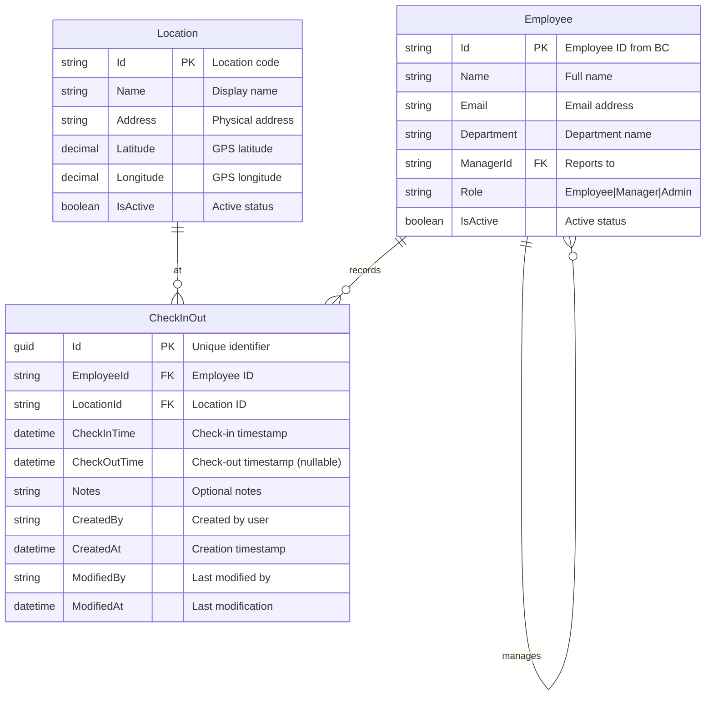
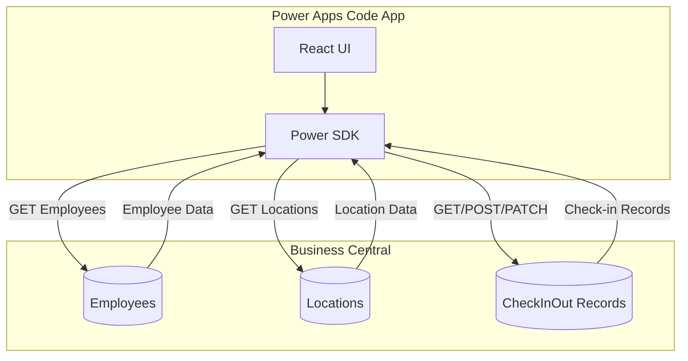
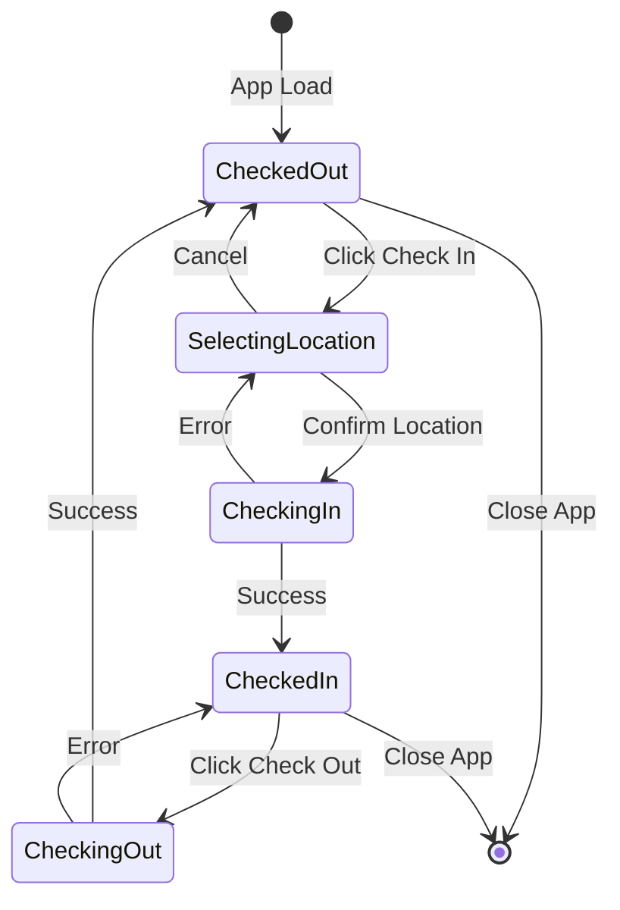
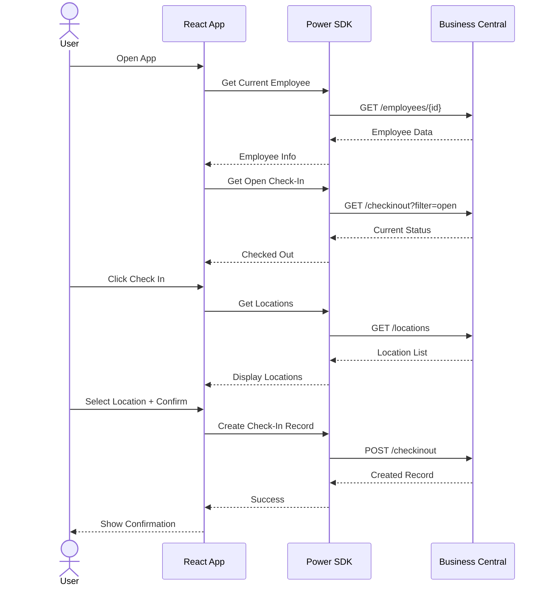

# Check In / Check Out App - Database Schema

## Entity Relationship Diagram

## Data Flow Diagram

## State Diagram - Check-In/Check-Out Flow

## Sequence Diagram - Check-In Process

## Business Central Table Specifications

### Employee Table (Standard BC Entity)
Uses the standard Business Central Employee entity with the following key fields:

| BC Field | App Field | Usage |
|----------|-----------|-------|
| No. | Id | Primary identifier |
| First Name + Last Name | Name | Display name |
| Company E-Mail | Email | User identification |
| Department Code | Department | Department grouping |
| Manager No. | ManagerId | Reporting hierarchy |

### Location Table (Custom BC Entity)
Custom table to be created in Business Central:

| Field No. | Field Name | Type | Length | Description |
|-----------|------------|------|--------|-------------|
| 1 | Code | Code | 20 | Primary Key |
| 2 | Name | Text | 100 | Display name |
| 3 | Address | Text | 250 | Full address |
| 4 | Latitude | Decimal | - | GPS coordinate |
| 5 | Longitude | Decimal | - | GPS coordinate |
| 6 | Active | Boolean | - | Is location active |

### CheckInOut Table (Custom BC Entity)
Custom table to be created in Business Central:

| Field No. | Field Name | Type | Length | Description |
|-----------|------------|------|--------|-------------|
| 1 | Entry No. | Integer | - | Auto-increment PK |
| 2 | Employee No. | Code | 20 | FK to Employee |
| 3 | Location Code | Code | 20 | FK to Location |
| 4 | Check-In DateTime | DateTime | - | Check-in time |
| 5 | Check-Out DateTime | DateTime | - | Check-out time |
| 6 | Duration (Minutes) | Integer | - | Calculated field |
| 7 | Notes | Text | 500 | Optional notes |
| 8 | Created By | Code | 50 | User ID |
| 9 | Created At | DateTime | - | Creation time |
| 10 | Modified By | Code | 50 | Last modifier |
| 11 | Modified At | DateTime | - | Last modified |

---

## Version History

| Version | Date | Author | Changes |
|---------|------|--------|---------|
| 1.0 | 2026-01-02 | - | Initial database schema |
