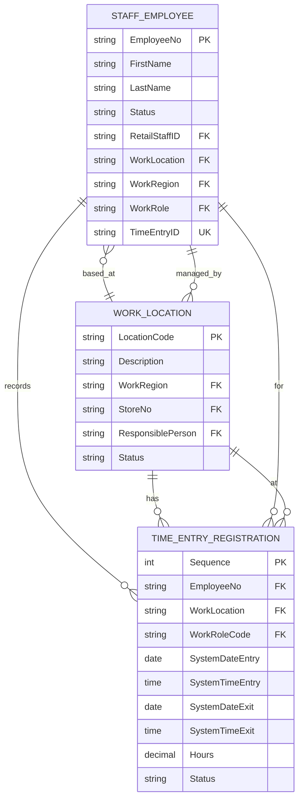

# Staff Management Database Schema

## Overview
This document describes the database schema for the LS Central Staff Management module, focusing on the three master tables and their relationships.

---

## Master Tables

### Table 10015057 - LSC STAFF Employee
**Purpose:** Central table for staff management employee records

**Description:** Manages employee information for workforce management, including personal details, work assignments, time entry configuration, and salary information.

#### Key Fields
| Field | Type | Description |
|-------|------|-------------|
| No. | Code[20] | Primary Key - Employee identification code |
| First Name | Text[30] | Employee first name |
| Last Name | Text[30] | Employee last name |
| Job Title | Text[30] | Job title description |
| Status | Option | Active/Blocked status |
| Retail Staff ID | Code[20] | Link to LSC Staff record |
| Retail User ID | Code[50] | Link to LSC Retail User (portal login) |
| Employee No. | Code[20] | Link to standard BC Employee |
| Work Region | Code[20] | Work region for employee sharing |
| Work Arrangement Code | Code[10] | Work arrangement for optimal hours |
| Work Location | Code[20] | Base work location for roster schedule |
| Time Entry ID | Code[20] | Personal ID for time registration |
| Salary System ID | Code[20] | ID for salary export reference |
| Work Shift | Code[20] | Fixed shift assignment |
| Work Role | Code[10] | Default work role |
| Average Cost pr. Hour | Decimal | Average hourly cost for estimates |
| Salary Type | Option | Hourly Rate/Fixed Monthly Rate/None |
| Fixed Monthly Rate | Decimal | Monthly cost if applicable |
| Shift Pattern | Code[20] | Fixed pattern for planning |
| Pattern Reference Date | Date | Start date for pattern |
| Time Entry Password | Code[10] | Password for time registration |
| Contact No. | Code[20] | Link to BC Contact |
| Search Name | Code[50] | Search/reference name |
| E-Mail | Text[80] | Email address for planning |
| Mobile Phone No. | Text[30] | Mobile phone |
| Phone No. | Text[30] | Phone number |

#### Business Rules
- Employee No. is auto-assigned from number series on insert
- Status changes trigger contract date updates
- Work Location change updates Work Region automatically
- Deleting employee requires no salary or time entries exist
- Time Entry ID and Salary System ID must be unique
- Default roles automatically assigned on insert

---

### Table 10015021 - LSC Work Location
**Purpose:** Master table for work locations/sites in staff management

**Description:** Represents physical locations where employees work, including stores, warehouses, or other facilities. Used for roster planning, time tracking, and salary processing.

#### Key Fields
| Field | Type | Description |
|-------|------|-------------|
| Code | Code[20] | Primary Key - Location identification |
| Description | Text[100] | Location description |
| Work Region | Code[20] | Work region for employee sharing |
| Schedule Number Series | Code[20] | Number series for roster planning |
| Store No. | Code[10] | Linked store for sales summary |
| Responsible Person | Code[20] | Contact person (LSC STAFF Employee) |
| Closing Date | Date | Last salary period export date |
| Status | Option | Active/Inactive status for salary export |
| Global Dimension 1 Code | Code[20] | Dimension for budget/sales filtering |
| Global Dimension 2 Code | Code[20] | Dimension for budget/sales filtering |
| Pattern Reference Date | Date | General pattern start date |
| Salary Location | Code[10] | Salary processing location |
| G/L Sales Account Filter | Code[250] | G/L account for sales filtering |

#### Business Rules
- Code is required and must be unique
- Deleting location cascades to shift locations and location roles
- Store Name is calculated from Store No.
- Responsible contact info (name, email, mobile) is calculated from Responsible Person

---

### Table 10015007 - LSC Time Entry Registration
**Purpose:** Transaction table for employee time clock entries

**Description:** Records all time clock punch-in and punch-out events for employees. Tracks actual work time, compares against scheduled time, and feeds into salary processing.

#### Key Fields
| Field | Type | Description |
|-------|------|-------------|
| Sequence | Integer | Primary Key - Auto-increment sequence |
| Employee No. | Code[20] | Employee making entry (FK to LSC STAFF Employee) |
| Work Location | Code[20] | Location of entry (FK to LSC Work Location) |
| Work Role Code | Code[10] | Role during this time (FK to LSC Work Roles) |
| System Date (Entry) | Date | System date of clock-in |
| System Time (Entry) | Time | System time of clock-in |
| System Date (Exit) | Date | System date of clock-out |
| System Time (Exit) | Time | System time of clock-out |
| User Date (Entry) | Date | User-entered clock-in date |
| User Time (Entry) | Time | User-entered clock-in time |
| User Date (Exit) | Date | User-entered clock-out date |
| User Time (Exit) | Time | User-entered clock-out time |
| Auto Date (Entry) | Date | Auto-calculated entry date |
| Auto Time (Entry) | Time | Auto-calculated entry time |
| Auto Date (Exit) | Date | Auto-calculated exit date |
| Auto Time (Exit) | Time | Auto-calculated exit time |
| No. Of Hours | Decimal | Calculated hours worked |
| Status | Option | Open/Closed/Processed |
| Entry Status | Option | OK/Early/Late/Not Scheduled |
| Leaving Status | Option | OK/Early/Late/Not in Schedule |
| Entry Method | Option | Automatic Entry/Manual Entry |
| Entry Employee Comment | Text[100] | Employee's comment |
| Supervisor Comment | Text[100] | Supervisor's comment |
| System Message | Text[100] | System-generated message |
| Origin (Logon) | Code[50] | Entry origin/terminal |
| Work Plan | Code[20] | Associated work plan |

#### Parent Table Relationships
- **LSC STAFF Employee** via Employee No. - Employee who made entry
- **LSC Work Location** via Work Location - Location of time entry

#### Business Rules
- Sequence is auto-incremented on insert
- Supports automatic (time clock) and manual entry methods
- Tracks both system time and user-adjusted time
- Status indicates processing state (Open → Closed → Processed)
- Entry/Leaving status validates against schedule
- Hours calculated from entry/exit times
- Used as source for salary entry generation

---

## Entity Relationship Diagram

---

## Data Flow

### Time Entry Process
1. **Employee Clocks In**
   - Record created in LSC Time Entry Registration
   - Employee No., Work Location, Work Role recorded
   - System Date/Time captured
   - Status = Open

2. **Employee Clocks Out**
   - Exit Date/Time recorded
   - Hours calculated
   - Entry/Leaving Status validated against schedule
   - Status changed to Closed

3. **Supervisor Review**
   - Review entries for accuracy
   - Add comments if needed
   - Adjust times if necessary

4. **Processing**
   - Time entries converted to Salary Entries
   - Status changed to Processed
   - Data exported for payroll

### Employee Assignment Process
1. **Employee Created**
   - Record in LSC STAFF Employee
   - Work Location assigned
   - Work Region auto-populated
   - Default roles assigned

2. **Location Assignment**
   - Primary location via Work Location field
   - Additional locations via LSC STAFF Work Location/Empl.
   - Location determines schedule and time entry location

3. **Schedule Creation**
   - Roster created in LSC Employee Roster Schedule
   - Based on Work Location, Role, Shift Pattern
   - References LSC Staff Schedule

---

## Key Integration Points

### With Business Central Standard Tables
- **Employee** - Links staff management to BC employee master data
- **Dimension Value** - Financial dimension integration for reporting

### With LS Central Retail
- **LSC Staff** - POS staff records
- **LSC Retail User** - User authentication and portal access
- **LSC Store** - Store master data

### Within Staff Management Module
- **LSC Work Region** - Geographical/organizational grouping
- **LSC Work Arrangement** - Work hour rules and calculations
- **LSC Work Roles** - Job function definitions
- **LSC Work Shifts** - Shift patterns and schedules
- **LSC Work Codes** - Salary/time entry categorization

---

## Performance Considerations

### Indexing Strategy
- **LSC STAFF Employee**: Indexed on No., Retail Staff ID, Retail User ID, Employee No., Time Entry ID, Salary System ID, Work Location
- **LSC Work Location**: Indexed on Code, Store No., Work Region
- **LSC Time Entry Registration**: Auto-increment Sequence provides natural clustering

### Data Volume Estimates
- **LSC STAFF Employee**: Low-Medium volume (100s to 1000s of records)
- **LSC Work Location**: Low volume (10s to 100s of records)
- **LSC Time Entry Registration**: High volume (1000s to millions of records) - transactional data

### Archival Strategy
- Time Entry Registration should be archived periodically after processing
- Salary Entries archive based on retention policy
- Employee records retained per legal requirements

---

## Security and Access Control

### Field-Level Security
- Time Entry Password: Masked field
- Salary information: Requires specific permissions
- Personal information: CustomerContent classification

### Table-Level Permissions
- Employees managed by HR users
- Time entries managed by supervisors and employees
- Salary processing restricted to payroll administrators
- Locations managed by system administrators

---

## Change History

| Date | Version | Author | Description |
|------|---------|--------|-------------|
| 2026-01-02 | 1.0 | System | Initial documentation |

---

## Additional Resources

### Related Tables Not Detailed Here
- LSC Work Region Members
- LSC Work Summary Warnings
- LSC Additional Work Codes
- LSC Shift Patterns
- LSC Work Arrangement
- LSC Employee Break Entries
- LSC Batch Time Entry Registration
- LSC Shift Exchange Requests
- LSC Employee Work Requests

### Configuration Tables
- LSC STAFF Setup
- LSC Work Codes
- LSC Shift Patterns
- LSC Special Day Settings

---

*This document provides a comprehensive overview of the Staff Management database schema. For implementation details, refer to the AL source code in the StaffManagement folder.*
